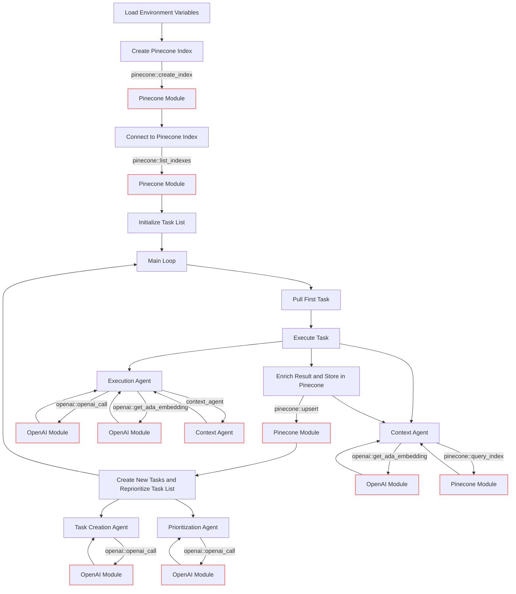

# CrustAGI 🦀

CrustAGI is a Rust-based implementation of an AI-powered task management system that uses OpenAI and Pinecone APIs to create, prioritize, and execute tasks. The system generates tasks based on the results of previous tasks and a predefined objective. It leverages OpenAI's natural language processing (NLP) capabilities to create new tasks and Pinecone to store and retrieve task results for context.

## How It Works
CrustAGI operates in an infinite loop, performing the following steps:

1. Load environment variables.
2. Create and connect to a Pinecone index.
3. Initialize the task list.
4. Enter the main loop:
* 1. Execute the first task and store the enriched result in Pinecone.
* 2. Use agents and modules to interact with OpenAI and Pinecone:
    - OpenAI is called to perform natural language processing tasks, generate embeddings, and assist with task creation and prioritization.
    - Pinecone is used for vector similarity search to query and retrieve contextually relevant information based on embeddings.
* 3. Create and reprioritize tasks based on insights from OpenAI.
* 4. Repeat the loop with the next task.
5. Continue the loop until a termination condition is met.



The program uses Pinecone (a cloud-hosted VectorDB) to create an index for storing task results, along with task names and additional metadata. The context_agent function retrieves the context of previously completed tasks from Pinecone to inform the execution of the current task.

## Getting Started with CrustAGI
To get started with CrustAGI, follow these steps:

1. Clone the CrustAGI repository and navigate to the cloned directory.
2. Ensure that you have the Rust environment set up
3. Set up environment variables for OpenAI and Pinecone API keys, Pinecone region and project ID, Pinecone index name, initial task, and objective. You can use a .env file to store these variables. The dotenv crate is used to load environment variables from the ```.env``` file.
4. Run the code using ```cargo run```.

Example .env file:

```
OPENAI_API_KEY="<your openai api key>"
OPENAI_API_MODEL="gpt-3.5-turbo"
PINECONE_API_KEY="<pinecone api>"
PINECONE_PROJECT_ID="<your pinecone project id>"
PINECONE_REGION="<your pinecone region>"
PINECONE_INDEX_NAME="test"
OBJECTIVE="<your objective>"
INITIAL_TASK="<the initial task>"
```

## Task Structure
Tasks are represented by the Task struct, which includes a task ID and task name. The task list is maintained as a ```VecDeque<Task>```.

## Functions
- ```task_creation_agent```: Generates new tasks based on the objective and result of the previous task.
- ```prioritization_agent```: Reprioritizes the task list based on the objective.
- ```execution_agent```: Executes the current task using OpenAI's API.
- ```context_agent```: Retrieves the context of previously completed tasks from Pinecone.
- ```add_task```: Adds a new task to the task list.

## Main Loop
The main function contains the main loop that continuously executes tasks, generates new tasks, and reprioritizes the task list. The loop sleeps for one second before checking the task list again.

## Why Rust and not Python?
- Deployment Flexibility: Rust provides a wide range of deployment options, making it an ideal choice for our project. We can deploy Rust applications on servers, edge devices, and even browsers using WebAssembly. This flexibility allows us to target a diverse set of platforms and environments.
- High Performance: Rust is known for its excellent performance characteristics, including efficient memory management and minimal runtime overhead. By choosing Rust, we can build applications that run faster and use resources more efficiently, which is especially important for AI and machine learning tasks.
- Memory Safety: Rust's strong focus on memory safety and its ownership model help prevent common programming errors such as null pointer dereferences and buffer overflows. This safety aspect is crucial for building reliable and secure applications, reducing the likelihood of vulnerabilities and crashes.
- Scalability: Rust's support for concurrency and parallelism allows us to build applications that scale effectively across multiple cores and processors. This scalability is essential for handling large workloads and ensuring that our applications can grow to meet increasing demands.
- Interoperability: Rust's C-compatible FFI (Foreign Function Interface) allows us to easily integrate with existing C and C++ libraries, as well as other languages. This interoperability enables us to leverage a vast ecosystem of existing code and tools while benefiting from Rust's modern features.
- Community and Ecosystem: Rust has a vibrant and growing community, along with a rich ecosystem of libraries and tools. By choosing Rust, we gain access to a wealth of resources and support that can help accelerate our development process and improve the quality of our applications.

## Disclaimer
CrustAGI is designed to run continuously as part of a task management system. Running this program continuously can result in high API usage, so please use it responsibly. Ensure that you have set up the OpenAI and Pinecone APIs correctly before running the program.

## License
CrustAGI is open-source software. For more information, please see the LICENSE file in the CrustAGI repository.

## Acknowledgments
We would like to acknowledge and thank @yoheinakajima for creating the original [BabyAGI](https://github.com/yoheinakajima/babyagi) project, which inspired the creation of CrustAGI. We also want to thank the contributors and community members who have supported and contributed to the development of both projects.

## Contact
For questions, issues, or contributions, please feel free to open an issue or pull request in the CrustAGI GitHub repository. We welcome feedback and contributions from the community.

## Contributing to CrustAGI
Contributions to CrustAGI are welcome! If you have an idea for improving the project or want to fix a bug, please open an issue or submit a pull request on the CrustAGI GitHub repository. When submitting a pull request, please provide a clear description of the changes you have made and the rationale behind them.
